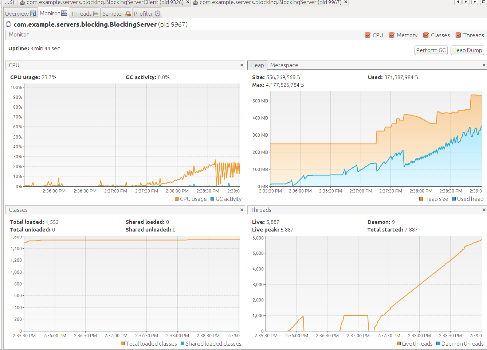
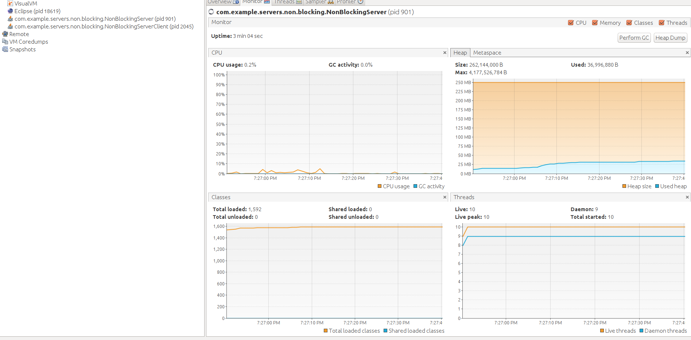

# java-io-nio
I/O blocking and non-blocking server examples

# Blocking I/O Servers
With blocking I/O, when a client makes a request to connect with the server, the thread that handles that connection is blocked until there is some data to read, or the data is fully written.
Until the relevant operation is complete that thread can do nothing else but wait.
Now to fulfill concurrent requests with this approach we need to have multiple threads, that is we need to allocate a new thread for each client connection.

*Metrics with 10,000 concurrent requests*

# Non-blocking I/O Servers
With non-blocking I/O, we can use a single thread to handle multiple concurrent connections.
## TODO add details

*Metrics with 10,000 concurrent requests*

